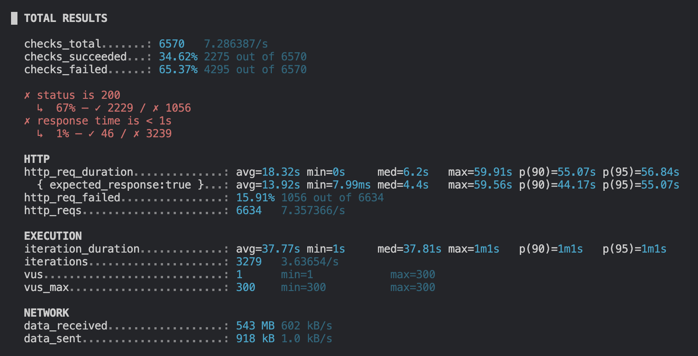
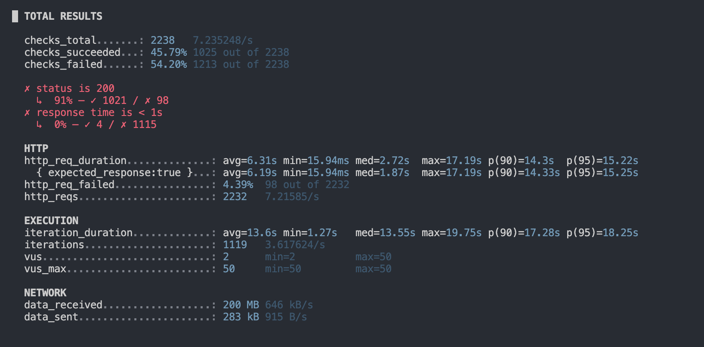
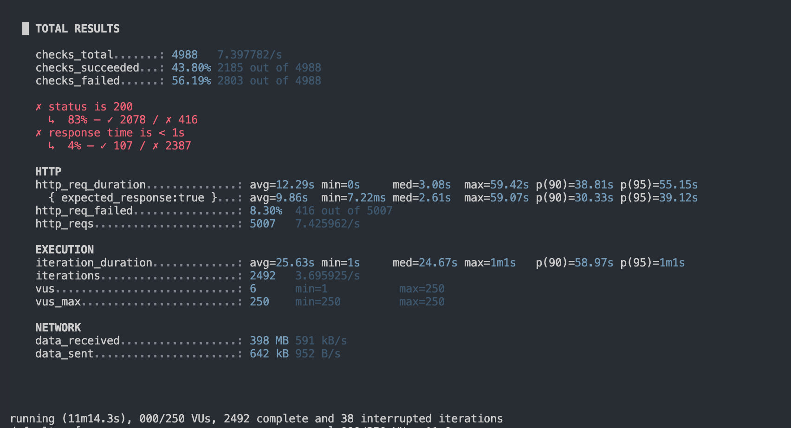

## 1.Average-Load Test
### ---ผลการทดสอบ---
| Metric             | ค่า          |
|-------------------|--------------|
| avg               | 6.31 วินาที  |
| median            | 2.72 วินาที  |
| p(90)             | 14.30 วินาที |
| p(95)             | 15.22 วินาที |
| max               | 17.19 วินาที |
| http_req_failed   | 4.39%        |
| จำนวน request     | 2232         |

### ---แนวทาวการทดสอบ---
vus: 50 -> จำลองผู้ใช้งานพร้อมกัน 50 คน เพื่อทดสอบโหลดเฉลี่ยของระบบ

duration: '5m' -> ทดสอบต่อเนื่องเป็นเวลา 5 นาที เพื่อดูประสิทธิภาพระหว่างโหลดสม่ำเสมอ

test_type: 'average_load' -> ใช้แท็กเพื่อจัดประเภทการทดสอบ

### ---สรุป---
การทดสอบ Average-load Test ที่ 50 Virtual Users พบว่า ระบบมีค่า response time สูงเกินเกณฑ์มาก (p95 = 17s) และมี error rate 2.
43% พร้อม log “connection refused” จำนวนมาก แสดงให้เห็นว่าระบบยังไม่สามารถรองรับโหลดระดับการใช้งานเฉลี่ยที่ 50 concurrent 
users ได้อย่างมีประสิทธิภาพ จำเป็นต้องปรับปรุงด้าน performance เช่น การเพิ่ม resource, ปรับโครงสร้าง backend, หรือตรวจสอบ bottleneck ภายในระบบ ก่อนทำการทดสอบในระดับโหลดที่สูงขึ้นอีกครั้ง

## 2.Stress testing
### ---ผลการทดสอบ---
| Metric            | ค่า         |
|-------------------|------------|
| avg               | 18.32 วินาที |
| median            | 6.20 วินาที  |
| p(90)             | 55.07 วินาที |
| p(95)             | 56.84 วินาที |
| max               | 59.91 วินาที |
| http_req_failed   | 15.91%     |
| จำนวน request     | 6634       |
### ---แนวทาวการทดสอบ---
vus: สูงสุด 300 → จำลองโหลดผู้ใช้พร้อมกันสูงสุดถึง 300 คน

duration: ไม่ได้ระบุ แต่ iteration_duration ยาว (avg 37s) → แสดงว่าระบบตอบสนองช้า ทำให้ iteration ค้างนานมาก

test_type: stress test / extreme-load → ลักษณะของค่า VUs และ latency ชี้ว่าการทดสอบนี้คือการดันทดสอบระบบให้ถึงขีดจำกัด

### ---สรุป---
ระบบ ยังไม่สามารถรองรับโหลดระดับ 300 concurrent users ได้อย่างมีประสิทธิภาพ และเกิดการเสื่อมสภาพของ performance ตั้งแต่ช่วงโหลดระดับกลางขึ้นไป (p90 > 55s ถือว่าหนักมาก)

## 3.Soak testting
### ---ผลการทดสอบ---
| Metric             | ค่า          |
|-------------------|--------------|
| avg               | 6.31 วินาที  |
| median            | 2.72 วินาที  |
| p(90)             | 14.30 วินาที |
| p(95)             | 15.22 วินาที |
| max               | 17.19 วินาที |
| http_req_failed   | 4.39%        |
| จำนวน request     | 2232         |

### ---แนวทาวการทดสอบ---
vus: 50 -> จำลองผู้ใช้งานพร้อมกัน 50 คน เพื่อทดสอบโหลดเฉลี่ยของระบบ

duration: '5m' -> ทดสอบต่อเนื่องเป็นเวลา 5 นาที เพื่อดูประสิทธิภาพระหว่างโหลดสม่ำเสมอ

test_type: 'soak' -> ใช้แท็กเพื่อจัดประเภทการทดสอบ

### ---สรุป---
ระหว่างการทดสอบพบข้อผิดพลาดจำนวนมาก เช่น unexpected EOF และ connection refused ซึ่งแสดงให้เห็นว่าระบบมีปัญหาในการรักษาความเสถียรเมื่อรันเป็นเวลานาน อาจเกิดจากการปิด connection โดยไม่คาดคิด การรั่วของ resource (memory leak หรือ connection leak) หรือ server overload

## 4. Spike testting

### ---ผลการทดสอบ---
| Metric | Value | Result |
|-------|-------|--------|
| Requests Total | 5007 | - |
| checks_succeeded | 43.80% (2185/4988) | ไม่ผ่าน |
| checks_failed | 56.19% (2803/4988) | ไม่ผ่าน |
| status is 200 | 83% (✓2078 / ✗416) | ไม่ผ่าน |
| response time < 1s | 4% (✓107 / ✗2387) | ไม่ผ่าน |
| http_req_failed | 8.30% (416/5007) | ไม่ผ่าน |

Latency / Response Time
| Metric | ค่า |
|--------|-----|
| avg | 12.29 วินาที |
| median | 3.08 วินาที |
| p(90) | 38.81 วินาที |
| p(95) | 55.15 วินาที |
| max | 59.42 วินาที |

### ---แนวทาวการทดสอบ---
ใช้ Spike Test เพื่อทดสอบความทนทานของระบบเมื่อโหลดพุ่งขึ้นแบบฉับพลัน และดูการฟื้นตัวหลังโหลดลดลง โดยกำหนด stages ดังนี้:

Base Load: 50 VUs เป็นเวลา 5 นาที เพื่อสร้างโหลดปกติเริ่มต้น  

Spike Load: เพิ่มทันทีเป็น 250 VUs เป็นเวลา 1 นาที

Recovery: ลดกลับมาที่ 50 VUs เป็นเวลา 5 นาที เพื่อดูว่าระบบกลับสู่สภาวะปกติได้หรือไม่

### ---สรุป---
ผลการทดสอบพบว่าเมื่อโหลดพุ่งขึ้นเป็น 250 VUs ระบบเกิด overload อย่างหนัก ทำให้ response time สูงขึ้นมาก (p95 = 55.15 วินาที) และมี error จำนวนมาก เช่น connection refused, request timeout, EOF และ connection reset by peer ซึ่งสะท้อนว่า server ไม่สามารถรับโหลด spike ได้ นอกจากนี้ในช่วง recovery หลังลดโหลดกลับเป็น 50 VUs ระบบยังคงมี error ต่อเนื่องและไม่สามารถฟื้นตัวกลับสู่ค่าปกติได้ จึงสรุปได้ว่าระบบไม่ผ่าน Spike Test ทั้งด้านความทนทาน (Resilience) และการฟื้นตัว (Recovery)

